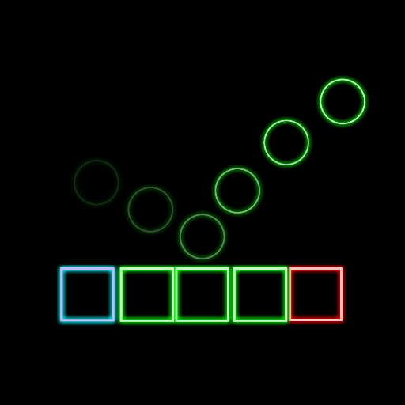
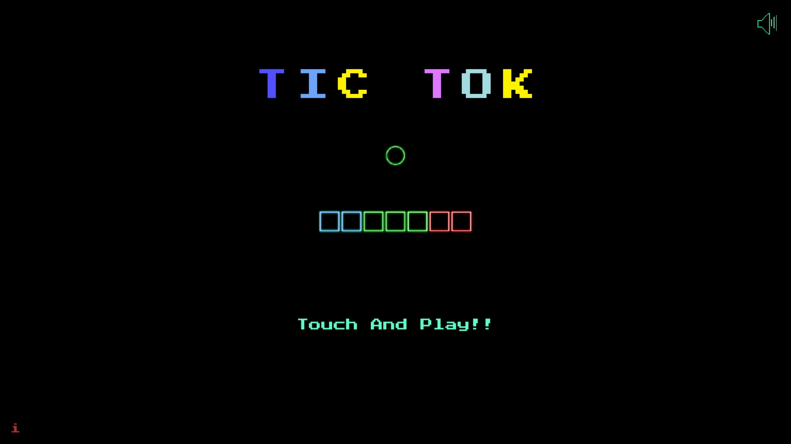
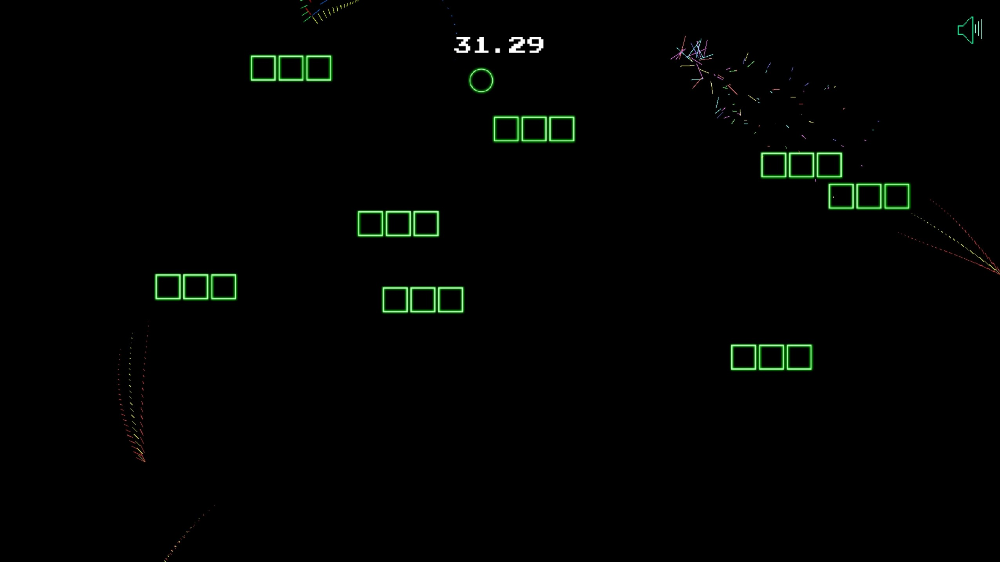
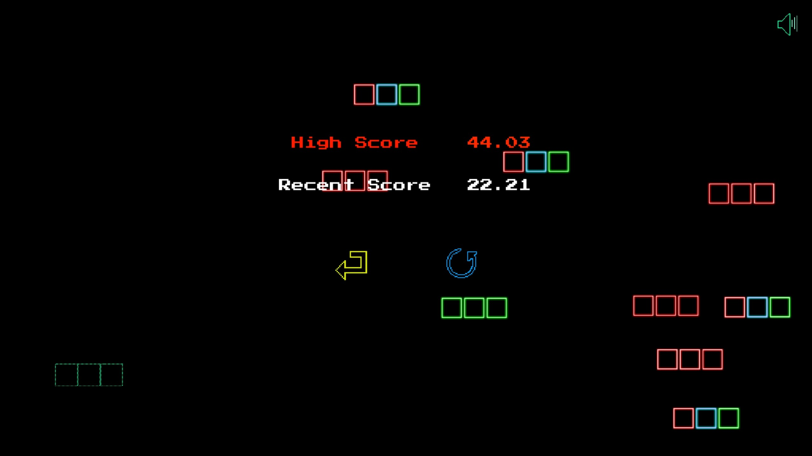

## Tic Tok
> ## 목차
 - [게임소개](#Infomation)
 - [게임화면](#게임화면)
 - [사용기술](#사용한-기술-및-배운점)
 - [개선점](#개선점)
___
> ## Infomation
  

|||
|:--:|:--|
|이름|Tic Tok|
|설명|화면의 좌우를 터치하고 지형들을 활용해 가장 오랜 기간 살아남는게임|
|특징|간단하고 단순한 조작과 인터페이스|
|제작기간| 20년01월26일 ~ 20년02월16일 (22일)|
|초기목표|간단한 조작으로 중독성을 느낄 수 있는 캐주얼 게임 제작|
|에셋|대부분 제작, 일부 에셋들은 Unity Asset Store에서 사용|
|자세한 제작과정| X |
|다운로드 링크|[Google Play](https://play.google.com/store/apps/details?id=com.namaan.TicTok)|
|영상 링크|X|
___
> ## 게임화면
|__ScreenShot__|||
|:--:|:--:|:--:|
||||
___
> ## 사용한 기술 및 배운점
  - 프리펩
  - 로고 제작
  - 기본적인 게임 돌아가는 방식
  - 구글 애드몹 사용법
    - 배너만 구현
  - PlayerFabs 사용법
    - 모든 데이터를 PlayerFabs를 사용
    - 보안에 취약
  - PlayStore 출시 관련 필요한 자료들
    - 아이콘, 출시 과정 등등
    - 출시 검사 오랜 시간 소유 (약 1주일) 

___
> ## 개선점
  - 후반으로 갈수록 너무 높은 난이도
  - 최적화가 이루어져있지 않다.
  - 스크립트의 복잡성과 유일성
  - 지형이 겹치는 경우가 다반사